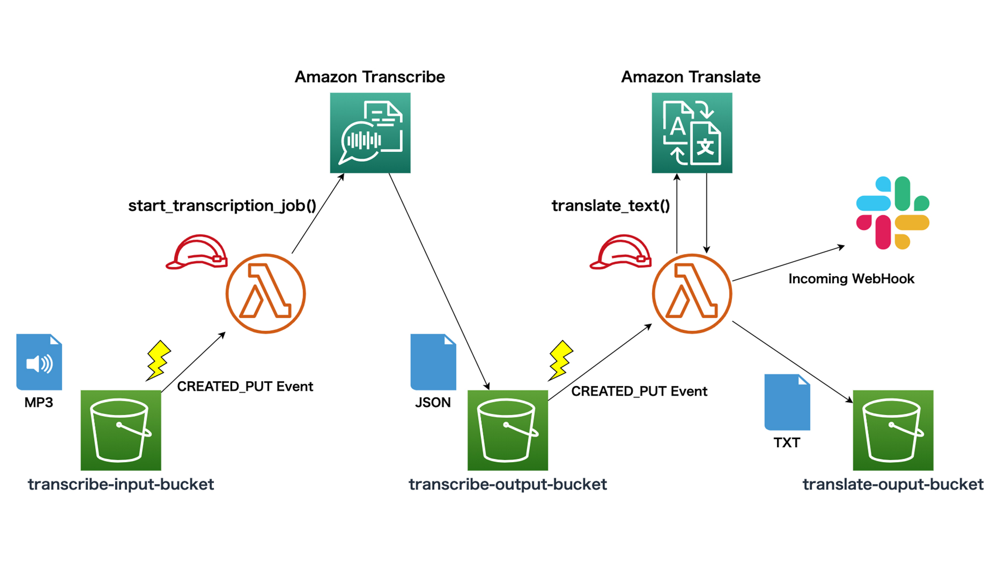

jaws-ug-bgnr-24-homework
---

# 概要

JAWS-UG 初心者支部#24 サーバレスハンズオン勉強会 にて宿題となっていた **文字起こし + 翻訳 パイプライン** を構築するための CDK プロジェクトです。

- [JAWS-UG 初心者支部#24 サーバレスハンズオン勉強会 - connpass](https://jawsug-bgnr.connpass.com/event/165065/)

この CDK プロジェクトで作成されるリソース、構築されるアーキテクチャは次のとおりです。

## 作成されるリソース

- S3 Bucket
  - 文字起こし対象ファイルアップロード用
  - 文字起こし結果出力用
  - 翻訳結果出力用
- Lambda 関数
  - 文字起こし用
  - 翻訳用
- IAM ロール、 IAM ポリシー
  - 文字起こし用 Lambda 関数用
  - 翻訳用 Lambda 関数用

## 構築されるアーキテクチャ



## アーキテクチャの詳細

- `transcribe-input-bucket` に英語の音声ファイル (`.mp3`) をアップロードすると、そのイベントをトリガーに、 Amazon Transcribe の API を実行する Lambda 関数が起動します。
- Transcribe による文字起こしの結果は JSON 形式で `transcribe-output` に出力されます。
- `transcribe-output-bucket` への JSON ファイルの出力をトリガーに、 Amazon Translate の API を実行する Lambda 関数が起動します。
- この Lambda 関数では、 Translate による翻訳結果を TXT 形式で `translate-output-bucket` に出力します。また、 Slack の WebHook URL が指定されている場合は Slack への通知も行います。

# 準備

1. AWS CDK のインストール (未インストールの場合)

    ```bash
    $ npm install -g aws-cdk
    $ cdk --version
    1.33.1 (build 8ad4d34)
    ```

2. リポジトリを clone

    ```bash
    $ git clone https://github.com/michimani/jaws-ug-bgnr-24-homework.git
    $ cd jaws-ug-bgnr-24-homework
    ```
    
    対象の AWS アカウントで CDK を初めて使用する場合は、下記のコマンドを実行します。
    
    ```bash
    $ cdk bootstrap
    ```

3. npm パッケージのインストール

    ```bash
    $ npm install
    ```

4. ソースコードの変更

    作成される S3 バケット名のサフィックスを編集します。(自分の名前など、一意になるような文字列を指定します)
    編集対象は `lib/jaws-ug-bgnr-24-homework-stack.ts` の 16 行目 です。
    
    ```typescript
    const s3BucketNameSufix = 'replace-to-any-string'
    ```
    
    Slack への通知を行う場合は Incoming WebHook の URL を指定します。編集対象は  `lib/jaws-ug-bgnr-24-homework-stack.ts` の 60 行目 です。
    
    ```typescript
    const slackWebHookUrl = 'https://*********'
    ```
  
5. CloudFormation テンプレートの生成

    ```bash
    $ cdk synth
    ```
    
    `cdk.out` ディレクトリに CloudFormation のテンプレートが生成されます。

6. CDK のデプロイ

    ```bash
    $ cdk deploy
    ```

# パイプラインの実行

`sample/HelloEnglish-Joanna.mp3` を `transcribe-input-****` バケットにアップロードします。  
しばらくすると `translate-output-****` バケットに翻訳結果が `yyyymmddhhmmss_Translate.txt` というキー名で出力されます。Slack の Incoming WebHook URL を指定している場合は、対象となっているチャンネルにも翻訳結果の文章が通知されます。

# リソースの削除

作成したリソースを削除する場合は、作成された S3 バケット内のオブジェクトをすべて削除したあとに、下記のコマンドを実行してください。

```bash
$ cdk destroy
```